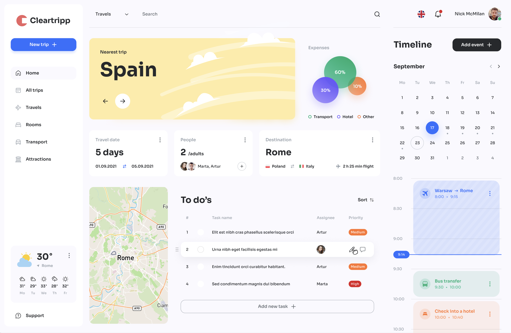

This is a [Next.js](https://nextjs.org/) project bootstrapped with [`create-next-app`](https://github.com/vercel/next.js/tree/canary/packages/create-next-app).

## Getting Started

First, run the development server:

```bash
npm run dev
# or
yarn dev
# or
pnpm dev
# or
bun dev
```

Open [http://localhost:3000](http://localhost:3000) with your browser to see the result.

You can start editing the page by modifying `app/page.js`. The page auto-updates as you edit the file.

This project uses [`next/font`](https://nextjs.org/docs/basic-features/font-optimization) to automatically optimize and load Inter, a custom Google Font.

## Learn More

To learn more about Next.js, take a look at the following resourc[]()

# `TRIPNEXT-FRONTEND`



#### <code>This project is an exciting and innovative travel planner dashboard designed to make your travel planning effortless and enjoyable. Whether you're planning a weekend getaway or a long vacation, this dashboard brings all the tools you need into one user-friendly interface.

Key features include:

- Upcoming Trip Overview: Stay on top of your next adventure with a snapshot of destination, travel dates, and companions.
- Expense Breakdown: Track your spending with an easy-to-read pie chart, helping you manage your budget across transport, accommodation, and other categories.
- To-Do List: Stay organized with a task manager that lets you assign, prioritize, and track your trip-related tasks.
- Interactive Map: View your destination on the map for better planning and navigation.
- Timeline & Calendar: Easily schedule your activities and track them with a visual timeline.
- Weather Forecast: Get real-time weather updates for your destination so you can pack accordingly.
  </code>

<p align="left">
		<em>Built with the tools and technologies:</em>
</p>
<p align="center">
	
	
	
	
	
	
	
</p>

<br>

##### 🔗 Table of Contents

- [📍 Overview](#-overview)
- [📂 Repository Structure](#-repository-structure)
- [🧩 Modules](#-modules)
- [🚀 Getting Started](#-getting-started)
  - [🔖 Prerequisites](#-prerequisites)
  - [📦 Installation](#-installation)
  - [🤖 Usage](#-usage)
  - [🧪 Tests](#-tests)
- [📌 Project Roadmap](#-project-roadmap)
- [🤝 Contributing](#-contributing)
- [🎗 License](#-license)
- [🙌 Acknowledgments](#-acknowledgments)

---

## 📍 Overview

<code>❯ This project is an exciting and innovative travel planner dashboard designed to make your travel planning effortless and enjoyable. Whether you're planning a weekend getaway or a long vacation, this dashboard brings all the tools you need into one user-friendly interface.</code>

---

## 📂 Repository Structure

```sh
└── tripNext-frontend/
    ├── README.md
    ├── app
    │   ├── alltrips
    │   ├── favicon.ico
    │   ├── globals.css
    │   ├── layout.js
    │   └── trips
    ├── components
    │   ├── Button
    │   ├── ClientWrapper
    │   ├── EventCalendar
    │   ├── ExpenseBubbleChart
    │   ├── LoadingSpinner
    │   ├── LocationMap
    │   ├── Login
    │   ├── Logo
    │   ├── MenuItem
    │   ├── Navbar
    │   ├── NewTripModal
    │   ├── Sidebar
    │   ├── Todo
    │   ├── Todos
    │   ├── TravelCards
    │   ├── TripCarousel
    │   ├── TripSwiper
    │   └── Weather
    ├── context
    │   └── TripContext.js
    ├── hooks
    │   ├── useEvents.js
    │   ├── useResizer.js
    │   ├── useTodos.js
    │   ├── useTrips.js
    │   ├── useUserData.js
    │   └── useUserLocation.js
    ├── jsconfig.json
    ├── middleware.js
    ├── next.config.mjs
    ├── package-lock.json
    ├── package.json
    ├── postcss.config.mjs
    ├── public
    │   ├── icons
    │   ├── images
    │   ├── next.svg
    │   └── vercel.svg
    ├── tailwind.config.js
    ├── tripContextEg.js
    └── utils
        └── timeUtils.js
```

---

## 🚀 Getting Started

### 🔖 Prerequisites

**JavaScript**: `version x.y.z`

### 📦 Installation

Build the project from source:

1. Clone the tripNext-frontend repository:

```sh
❯ git clone https://github.com/Lord-Aman/tripNext-frontend
```

2. Navigate to the project directory:

```sh
❯ cd tripNext-frontend
```

3. Install the required dependencies:

```sh
❯ npm install
```

### 🤖 Usage

To run the project, execute the following command:

```sh
❯ npm run dev
```

---

## 🙌 Acknowledgments

- List any resources, contributors, inspiration, etc. here.

---es:

- [Next.js Documentation](https://nextjs.org/docs) - learn about Next.js features and API.
- [Learn Next.js](https://nextjs.org/learn) - an interactive Next.js tutorial.

You can check out [the Next.js GitHub repository](https://github.com/vercel/next.js/) - your feedback and contributions are welcome!
